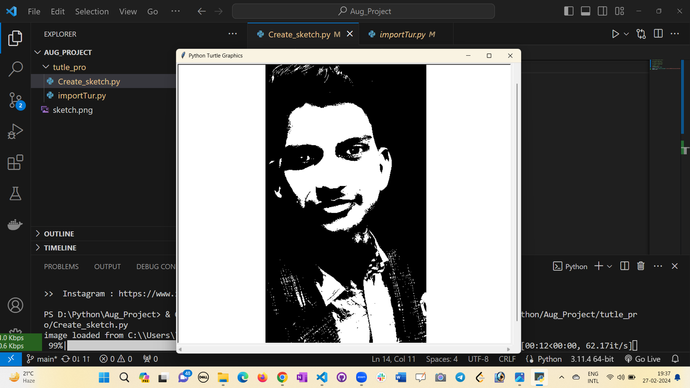

**Sketchpy-Create-Sketch**
In this playful Python project using SketchPy or Turtle graphics, we embark on a visually engaging journey to create a dynamic scene featuring a vibrant yellow circle nestled within the confines of an octagon. The chosen Python modules allow for an interactive and beginner-friendly experience, making it an excellent choice for those exploring the world of programming and art


## Installation

To install Sketchpy , follow these steps:

1. Clone the repository to your local machine:

    
   ```
      git clone https://github.com/Amarjeet5822/Create-Sketch.git
   ```
2. Navigate to the cloned directory:

    
   ```
   cd Create-Sketch
   ```
    

3. from sketchpy Import the necessary dependencies:

    
   ```
      sketch 
   ```

   ```  
      turtle
   ``` 

## Usage

Once import, you can launch Picture by running the following command:


```
   python Create-Sketch.py
```


Follow the on-screen instructions to initiate typing practice sessions and improve your typing skills.

## Starting


## Results


## Contact

For any inquiries or support, please contact us at [amar.bst5822@gmail.com](mailto:amar.bst5822@gmail.com)
